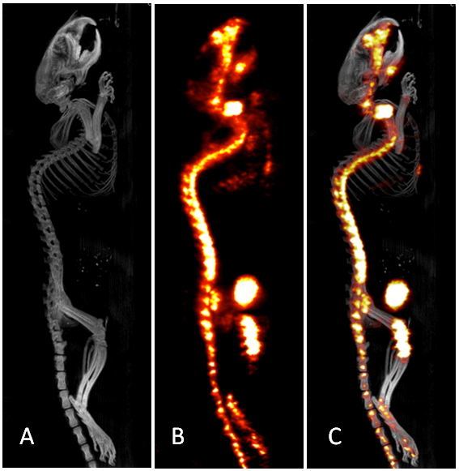

pyAtlasBoneSegmentation
=======================

# Overview

This software was developed as part of my Biomedical Engineering Masters [thesis].

The program tries to automatically segment user defined bone groups (skull, spine, tibia, ...) from a fused CT/Nuclear Image dataset. This allows for easy analysis of radionuclide uptake in each bone group.

Check out the [demo video].

## Detailed Overview

### Purpose

Preclinical imaging analyzes large quantities of data to draw generalized conclusions. Manual analysis of each dataset is time consuming process. Automation, even partial animation, alleviates this bottleneck and can increase throughput in the lab.

### Background
[CT], [SPECT], and [PET] are 3D imaging technologies. SPECT and PET are collectively refereed to as Nuclear Imaging, or NI. 



The figure above shows a CT, NI, and then NI overlaid on the CT. NI is used to capturing physiological information, but doesn't provide much information about anatomical location. CT can be combined with the NI image to provide that anatomical reference.

### Software
The software requires three components.
  * Articulated Atlas
  * CT dataset
  * NI dataset (that can be fused with the CT dataset)

#### Articulated Atlas
The Articulated Atlas is comprised of STL files, each representing a bone group, and an XML file that describes the relationships between the bones by joint type and location. The [MOBY Mouse] project was used as the atlas for development. An XML file for this project can be found at *atlases/MOBY_package/MOBY Atlas.xml*. The actual STL files for the MOBY project must be requested from the MOBY mouse authors. If you choose to make your own atlas, you can use the XML file as a format guide.

#### CT/NI Datasets
The CT and NI datasets are provided in separate DICOM files. with the following fields:
* pixel_array
    * 3 dimensional volume of scan data
* RescaleSlope and RescaleIntercept
    *  slope and intercept to change to Hounsfield units
*  SliceThickness
    *  thickness of each axial slice


# How to use the software

## Prerequisites
  * Python 2.7
  * numpy
  * scipy
  * PySide
  * PyOpenGl
  * lxml
  * pydicom
  * cgkit
  * mlabwrap
  * nlopt

## Segmenting
  1. Start the user interface, from the _src_ directory run
```
python pyAtlasSegmentation.py
```
  1. Press Automate to start the automation process.
  1. Choose the XML file for the atlas you want to use (ex. *atlases/MOBY_package/MOBY Atlas.xml*)
  1. Choose a CT DICOM file (ex. *dicom/test/TEST_1-10_CT.dcm*)
  1. Choose the corresponding NI DICOM file (ex. *dicom/test/TEST_1-10_SPECT.dcm*)
  1. Watch the magic happen (slowly). The alignment method uses nonlinear optimization from matlab. If you don't have matlab, then you need to change the optimization algorithm by passing some keywords to the ICP object, set minimizeMethod='custom' and optionally set optAlg to a nlopt optimization routine, if not specified, it defaults to nlopt.GN_CRS2_LM


[thesis]:http://scholarworks.gvsu.edu/theses/19/
[CT]:http://en.wikipedia.org/wiki/X-ray_computed_tomography
[SPECT]:http://en.wikipedia.org/wiki/SPECT
[PET]:http://en.wikipedia.org/wiki/Positron_emission_tomography
[MOBY Mouse]:http://www.jhttonline.jhu.edu/TechnologyDetail.aspx?TechID=4282CAE3-A4B3-4FFB-BDA6-628E0E554CE1
[demo video]:https://www.dropbox.com/s/anmisr9qetuxdor/Software%20Automated%20Animation.avi